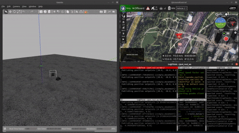

# 자율주행 군집 로버
* 사람이 운행 중인 차량을 추종하는 자율주행 차량 시스템 개발
* 각 차량에 개별적으로 배치하여 시스템의 비용을 절감하여 고효율 시스템 개발을 목표로 함

## 사용 기술
|개발 환경 | 사용 기술|
|---|---|
|OS|  |
| 프로그래밍   언어 |   |
| 프로젝트 관리 도구 |  |

## 개발 알고리즘 구현
* Pure Pursuit 기반 차량 추종

    

